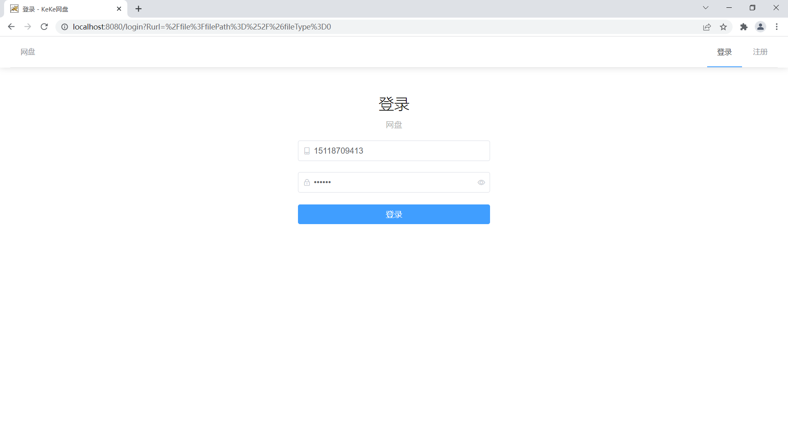
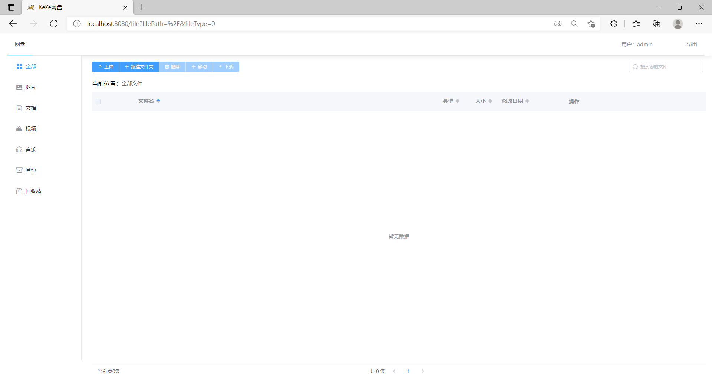
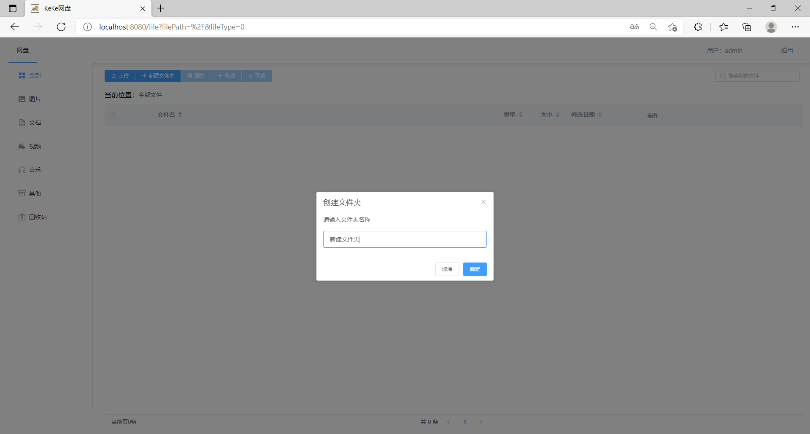
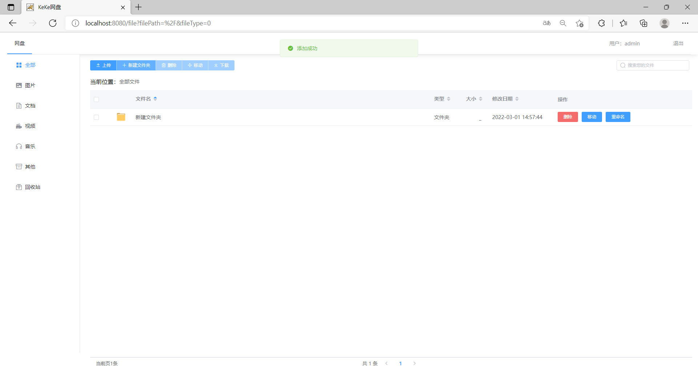
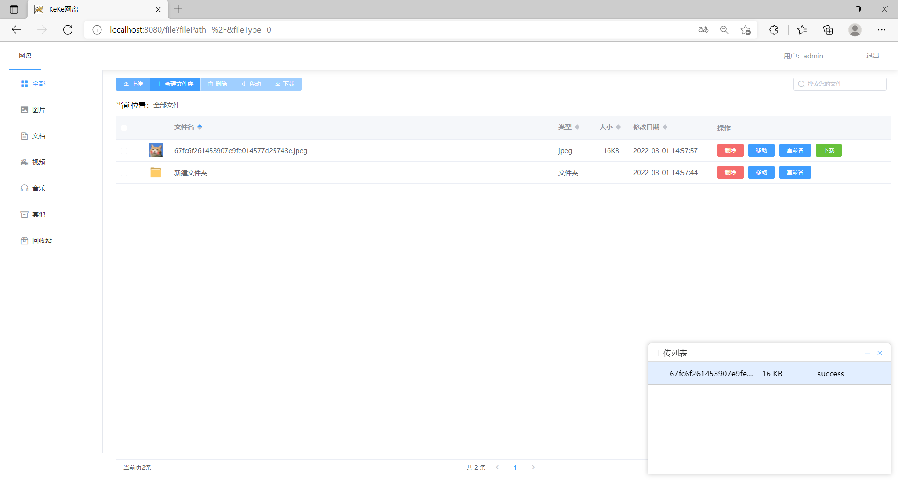
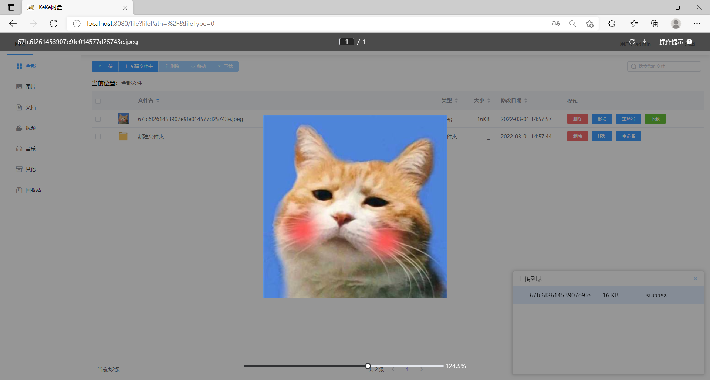
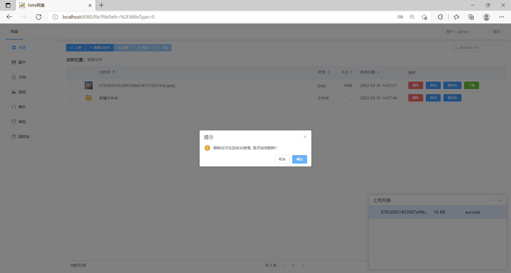
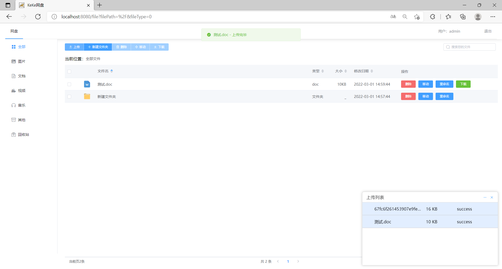
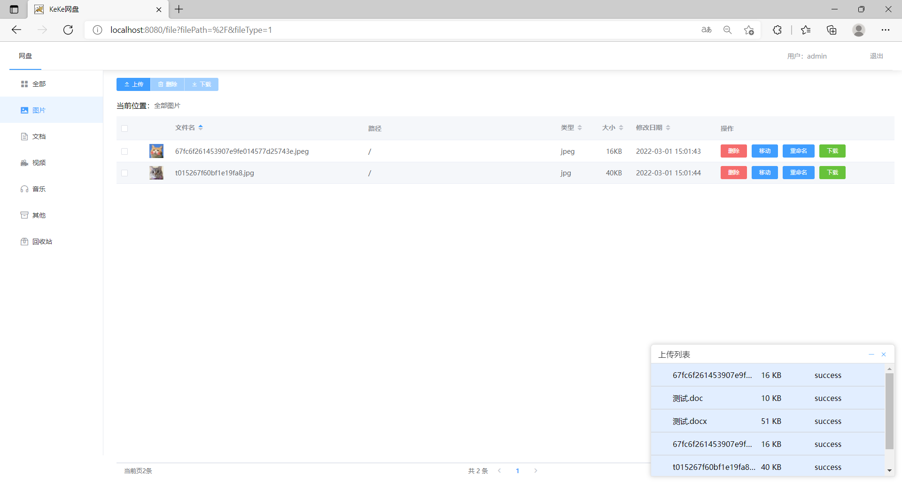

# aprilz-cloud-ui

#### 介绍

[aprilz-cloud](https://github.com/liushaohui1/aprilz-cloud.git)

简简单单的网盘系统--前端

简单实现文件分片上传、秒传及断点续传的全局上传。

主要用来学习[vue-simple-uploader](https://github.com/simple-uploader/vue-uploader/blob/master/README_zh-CN.md )插件

#### 软件架构
Vue2、ElementUI、vue-simple-uploader


#### 安装教程

需要配合nginx使用   /doc/nginx.conf

1. 安装一下  
````
  npm install --registry=https://registry.npm.taobao.org  
  ````
2. 运行一下
````
  npm run build
````


上传的文件默认保存在类路径下： application.yml file.path 以及nginx中，需要同步修改


#### 使用说明

1. 登录界面
   
2. 首页
   
   
   
   
   
   
   
   
   

#### 参与贡献

本人比较菜，不喜勿喷  
网上参考的代码挺多的，谢谢前人的轮子。

大部分参考keke-cloud-ui

